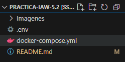
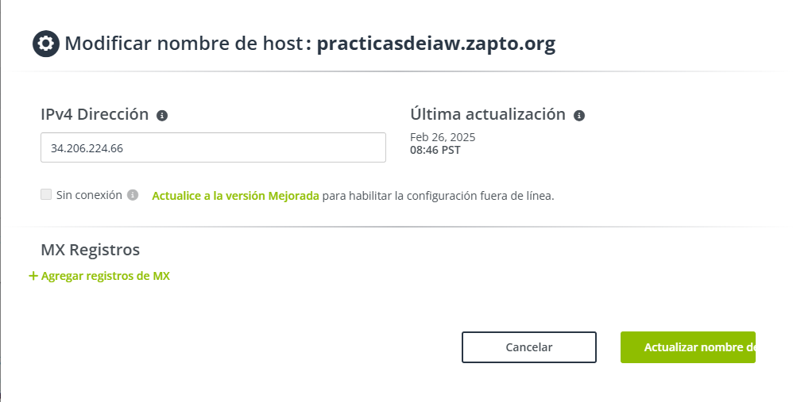
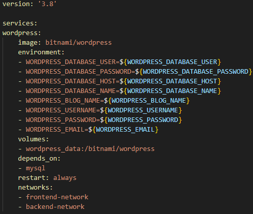
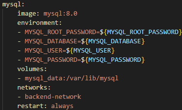
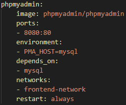
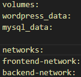
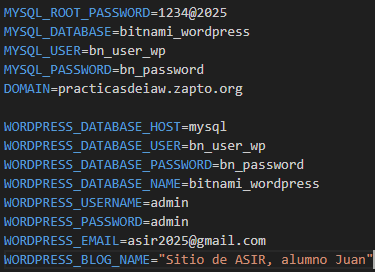
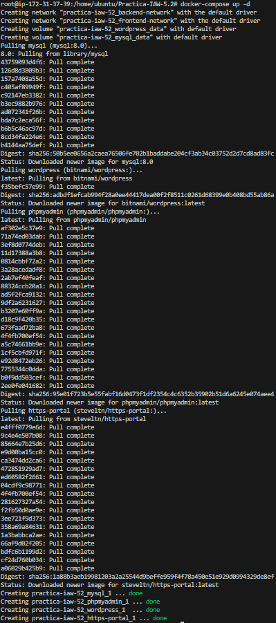
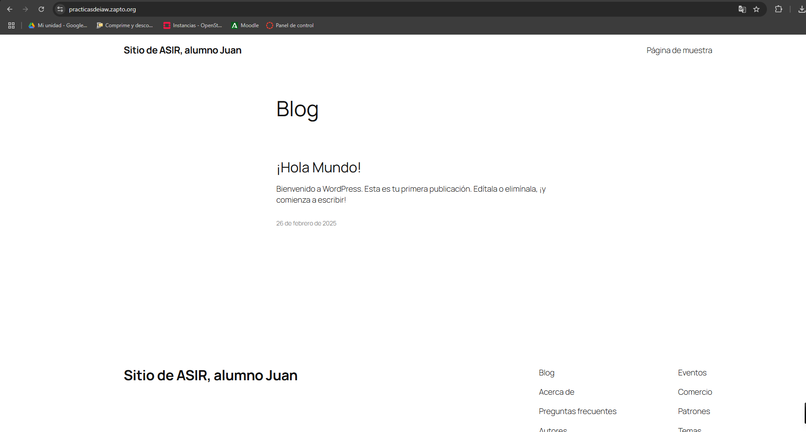
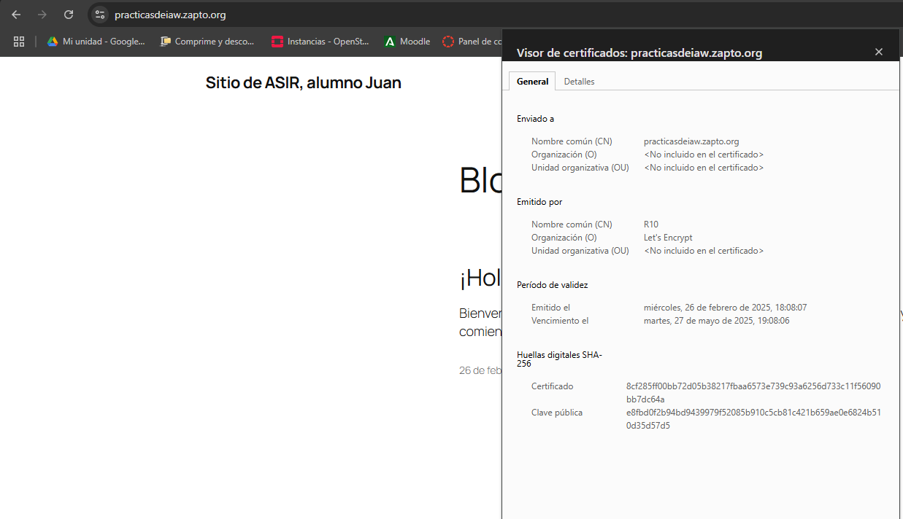

# Practica-IAW-5.2: Despliegue de WordPress con Docker y Docker Compose


## Estructura de la Práctica




## Objetivo de la Práctica

El objetivo de esta práctica es desplegar un sitio Wordpress en AWS utilizando Docker y Docker Compose, dónde automatizaremos el despligue de Wordpress incluyendo la base de datos de MySQL, PHPMyAdmin y con portal HTTPS aseguraremos una conexión segura a través de nuestro dominio con un certificado SSL.

>[**NOTA**]  
>Para esta práctica, usaremos para los servicios a implementar, imágenes de Docker Hub de forma que para cada servicio se usen las siguientes:

- **wordpress:** bitnami/wordpress.
- **mysql:** mysql.
- **phpmyadmin:** phpmyadmin/phpmyadmin.
- **https-portal:** steveltn/https-portal.


## Recordatorio de cambio de la dirección IP para actualizar el nombre de dominio de  nuestra página web

>[!IMPORTANT]  
>Para esta práctica, crearemos un nuevo nombre de dominio personalizado dónde asociaremos la dirección IP de nuestra máquina, para posteriormente establecer el dominio cómo seguro.




## Desarrollo de la práctica 


- **`docker-compose.yml`:** Este archivo permite ejecutar un entorno completo con MySQL, PHPMyAdmin, Wordpress y HTTPS-PORTAL de manera automatizada.


**Contenido del archivo:** 
   
   ```bash

    version: '3.8'

    services:
    wordpress:
        image: bitnami/wordpress
        environment:
        - WORDPRESS_DATABASE_USER=${WORDPRESS_DATABASE_USER}
        - WORDPRESS_DATABASE_PASSWORD=${WORDPRESS_DATABASE_PASSWORD}
        - WORDPRESS_DATABASE_HOST=${WORDPRESS_DATABASE_HOST}
        - WORDPRESS_DATABASE_NAME=${WORDPRESS_DATABASE_NAME}
        - WORDPRESS_BLOG_NAME=${WORDPRESS_BLOG_NAME}
        - WORDPRESS_USERNAME=${WORDPRESS_USERNAME}
        - WORDPRESS_PASSWORD=${WORDPRESS_PASSWORD}
        - WORDPRESS_EMAIL=${WORDPRESS_EMAIL}
        volumes:
        - wordpress_data:/bitnami/wordpress
        depends_on:
        - mysql
        restart: always
        networks:
        - frontend-network
        - backend-network


    mysql:
        image: mysql:8.0
        environment:
        - MYSQL_ROOT_PASSWORD=${MYSQL_ROOT_PASSWORD}
        - MYSQL_DATABASE=${MYSQL_DATABASE}
        - MYSQL_USER=${MYSQL_USER}
        - MYSQL_PASSWORD=${MYSQL_PASSWORD}
        volumes:
        - mysql_data:/var/lib/mysql
        networks:
        - backend-network
        restart: always

    phpmyadmin:
        image: phpmyadmin/phpmyadmin  
        ports:
        - 8080:80
        environment:
        - PMA_HOST=mysql
        depends_on:
        - mysql
        networks:
        - frontend-network
        restart: always

    https-portal:
        image: steveltn/https-portal
        ports:
        - 443:443
        - 80:80
        environment:
        - DOMAINS=${DOMAIN} -> http://wordpress:8080
        - STAGE=production
        depends_on:
        - wordpress
        networks:
        - frontend-network
        restart: always

    volumes:
    wordpress_data:
    mysql_data:

    networks:
    frontend-network:
    backend-network:
   ```


Dado el contenido del archivo entero iremos desglosándo poco a poco explicando la función de cada bloque de comandos.



En primer lugar, definimos la versión del formato del archivo, siéndo la versión 3.8, compatible con las versiones más recientes de Docker Compose.

En segundo lugar, declaramos que el servicio va a ser "wordpress" y le indicamos la imagen, en este caso será la de bitnami.

Posteriormente, indicaremos las variables necesarias (definidas en nuestro archivo .env) para que wordpress pueda funcionar correctamente en nuestro entorno.

Indicaremos también el volumen de datos, en este caso será el volumen persistente, dónde se almacenará los archivos y configuración de Wordpress en la ruta "/bitnami/wordpress".

Ajustaremos la dependencia entre servicios, de forma que MySQL inicie antes que Wordpress.

Por último sobre este servicio, asignamos las redes, que en este caso trabajaremos con la red frontend y backend.




En primer bloque, declaramos que el servicio va a ser llamado "mysql", le especificaremos la imagen de MySQL, que en este caso será la versión 8.0 de Docker Hub.


Le indicaremos mediante las variables almacenadas la contraseña root de MySQL, nombre de la base de datos, nombre de usuario así cómo contraseña de dicho usuario.

Definiremos también el volumen para la persistencia de datos, que en este caso será el directorio "/var/lib/mysql".

Indicaremos la red de conexión, que en este caso será la red backend y por último ajustaremos la política de reinicio, indicando que si el contenedor falla o si el servidor se reinicia, se reinicie automáticamente.




En este caso, definiremos el servicio phpmyadmin, dónde le especificamos la imagen de phpmyadmin, le indicaremos los puertos de forma que en el host (navegador) su puerto sea el 8080, pero dentro del contenedor su puerto sea el 80.

Siguiendo, le indicaremos mediante la variable de entorno "PMA_HOST" el nombre del contenedor con el que queremos conectarnos desde phpMyAdmin.

El paso siguiente será indicarle la dependencia con MySQL, significando que PHPMyAdmin se iniciará después de que MySQL esté en marcha.

En siguiente lugar, le especificaremos las redes que en este caso utilizará la red backend.

Al igual que MySQL, le aplicaremos la correspondiente política de reinicio por si el sistema falla.


En siguiente y último lugar, procedemos a la explicación de los parámetros referentes a Portal HTTPS.


Cómo es de esperar, declaramos el servicio https-portal actuándo cómo servidor proxy inverso con soporte HTTPS.

Le indicamos la imagen a utilizar, en este caso será "steveltn/https-portal" de forma que proporcione un proxy NGINx con certificados SSL firmados automáticos.

Le indicamos los puertos, al ser una tecnología relacionada con HTTP y HTTPS, le indicaremos sus puertos correspondientes, tanto cómo el 80 y el 443.

En la sección de las variables de entorno, indicamos que defina el dominio que apuntará a Wordpress, redirigiendo el tráfico hacia el contenedor de Wordpress en el puerto 8080, y especificándole que tome el valor de la variable para definir el dominio personalizado.

El parámetro "STAGE: 'production'" indica que el entorno es de producción, y que se usarán certificados reales de Let´s Encrypt.

Especificamos que el servicio no empieze hasta que Wordpress no esté iniciado correctamente.

También le indicaremos que se conecte a la red frontend para comunicarse con WordPress.

Y por último, ajustamos la misma política de reinicio al igual que en los demás servicios.


En último lugar del archivo, indicaremos los volúmenes para la persistencia de datos y le indicaremos las redes, que cómo hemos mencionado anteriormente, hemos definido la red frontend y backend.




Tras explicar la función del archivo, seguimos con el desarrollo de la práctica.


### Variables incluidas en el archivo ".env"




### Comprobaciones generales

Una vez redactados los comandos útiles, probaremos la ejecución del script a modo que se ejecute sin errores.




Tras ejecutar el script, nos dirigimos a la página de nuestro dominio y cómo podemos observar cargará nuestro sitio de Wordpress. Si nos fijamos, cargan correctamente los datos ya qué cómo "Título del Sitio" un nombre personalizado y tras implementarlo, podemos ver que el nombre figura correctamente.





### Detalles de nuestro Certificado

Tras haber completado toda la instalación, visualizaremos los detalles de nuestro certificado.


